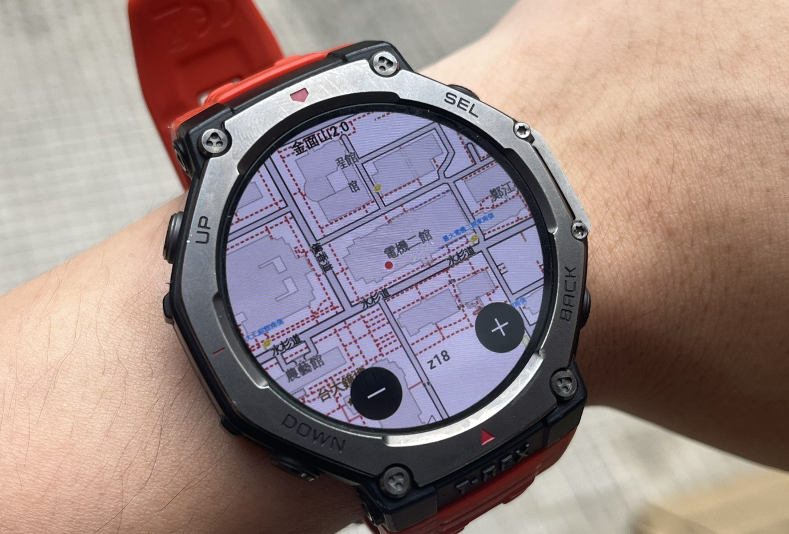
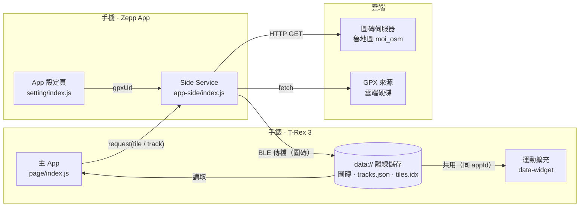

# Rudy map — Amazfit T-Rex 3 離線登山地圖

Amazfit T-Rex 3（Zepp OS）自製**離線等高線地圖 App**：讀手錶 GPS、在錶面顯示等高線圖層、匯入 GPX 航跡，並**沿著航跡把圖磚預先下載進手錶**，讓登山在**無訊號**環境也能定位、看自己的路線。圖磚不打包進安裝包，而是快取在手錶 `data://`（安裝包僅約 100KB）。

> A custom **offline** topographic-map app for the Amazfit T-Rex 3 (Zepp OS): GPS positioning on contour tiles, GPX route import, and route-based tile prefetch so it works with **no signal** on the mountain.

---

## 📷 畫面 Screenshots

<p align="center">
  
</p>

> 實機畫面：等高線底圖 + GPS 紅點 +（選定航跡）黃線。
> _之後可再補一段戶外使用的 GIF（紅點移動），說服力更高。_

---

## ✨ 功能 Features

- 🛰️ **GPS 即時定位**（紅點）、跟隨置中、拖曳平移、縮放、比例尺、時鐘
- 🗺️ **離線等高線地圖**（魯地圖 / MOI OSM 圖層），圖磚快取在手錶 `data://`
- 📥 **GPX 航跡匯入**：在手機設定頁填雲端連結（Google Drive / Dropbox / 直接 `.gpx`），解析後畫成航跡線
- 📦 **沿線預先下載**：只抓「選定航跡」經過的圖磚（分層帶不同圈數鄰磚），有真實同步進度
- 🧭 **多航跡管理**：清單、選定（驅動畫線 / 移到航跡 / 下載）、刪除，並持久化
- 🧹 **圖磚管理**：每條航跡的圖磚張數 / 容量分開檢視與刪除
- 🏃 **Workout Extension**：運動中把離線地圖當成資料頁，由系統一併記錄軌跡
- 📡 手機端 side service 下載圖磚 → 藍牙傳到手錶（ZML）

---

## 🧱 架構 Architecture

三層：**手錶端** ↔ **手機端（負責上網）** ↔ **雲端**。圖磚不能由手錶直接下載，而是手機代抓後經藍牙傳進手錶離線儲存。



**關鍵資料流**
- **瀏覽缺圖磚**：`device.request(tile)` → 手機下載 → 轉檔 → `sendFile` 藍牙傳 → 落在 `data://download/` → 顯示
- **GPX 匯入**：設定頁存 `gpxUrl` → 手機 `fetch` + 解析（抽稀 8m）→ 回傳精簡座標 → 手錶存進 `tracks.json`
- **沿線下載**：算出選定航跡沿線所有圖磚 → 並發走上面的管線，進度以「**真的傳進手錶**」計算
- **運動擴充**：與主 App 同一個 appId → 直接共用 `data://`（圖磚、選定航跡），不必重抓

---

## 🔧 工程亮點 Engineering highlights

在「**手錶看不到 log、記憶體 / CPU 受限**」的環境下，靠螢幕自建診斷把問題一個個量化、定位、修掉：

| 問題 | 根因 | 解法 | 成效 |
|---|---|---|---|
| 開檔慢 | 開檔時把每條航跡座標字串整個解析 | 座標**延後解析**、第一張畫面不畫線 | **2659ms → 120ms** |
| 點功能**手錶重啟**（watchdog） | 對上千張圖磚逐一同步 `statSync` 卡死執行緒 | 改記憶體計數 + 抽樣估容量 | 消除當機 |
| 掃資料夾越來越慢 | 圖磚平放、每次開檔 readdir 全掃 | 改讀**索引檔 `tiles.idx`**，保留 statSync 後援 | 不論張數都瞬間 |
| 運動頁暫停 / 儲存**黑屏** | 拆畫面當下 GPS 回呼仍在重畫 | **生命週期守衛** + 暫停停 GPS + 重畫節流 | 不再黑屏 |
| 航跡線重畫卡 | 每次重畫走遍整條（幾千點） | **bbox 快篩** + 只投影視窗附近的點 | 遠離航跡時零成本 |
| 記憶體吃緊 | 一次建所有航跡集合、`O(n²)` 字串相接 | 單條才建集合 + union 上限 + 改 `join` | 穩定 |

---

## 🛠️ 技術棧 Tech stack

JavaScript · Zepp OS Mini Program · Zeus CLI · ZML（`@zeppos/zml`）· `@zos/*`（ui / sensor-Geolocation / fs / display / interaction / app）· BLE 檔案傳輸 · Web Mercator · Workout Extension（`data-widget`）

---

## 📁 專案結構 Project structure

```
page/index.js                 手錶主畫面：地圖渲染、GPS、互動、圖磚管理、下載協調
app-side/index.js             手機 Side Service：下載圖磚 / GPX → 轉檔 → 藍牙傳檔
setting/index.js              手機 App 設定頁：填 GPX 網址（多使用者）
data-widget/common/index.js   運動擴充：運動中顯示離線地圖
utils/tile.js                 Web Mercator 經緯度 ↔ 圖磚座標換算
utils/track-data.js           內建範例航跡
tools/                        電腦端工具：GPX 轉檔、批次下載圖磚（可選）
```

---

## 🗺️ 圖資來源 / Attribution

地圖圖磚來自 **happyman（魯地圖）** `https://tile.happyman.idv.tw/`，底圖資料為 **© OpenStreetMap contributors** 與內政部（MOI）圖資。

> ⚠️ 本專案**不含、也不重新散布任何圖磚**；圖磚由 App 於執行時向上述服務下載。使用時請遵守該服務的使用條款與流量規範（僅供個人、非商業用途，勿大量抓取）。

---

## 🚀 開發 Development

```bash
npm i @zeppos/zeus-cli -g   # Zeus CLI
npm install                 # 專案依賴
zeus dev                    # 模擬器預覽
zeus preview                # 產生 QR，掃描安裝到手錶（需手機 Zepp App 開啟開發者模式）
```

> 下載圖磚需手機 Zepp App 連線（side service 在手機端執行）。離線使用前，請先在有連線時用「下載沿線圖磚」把路線圖磚預抓進手錶。

---

## ⚠️ 已知限制 Limitations

- **即時抓圖磚需手機連線**；山上離線只能看「事先預抓」的圖磚（這也是沿線下載存在的原因）。
- 圖磚來源為社群免費服務，**僅適合個人使用**；若要公開散布需先取得授權。
- 運動頁（Workout Extension）為單頁、不支援捲動；運動中點擊縮放鈕會被系統攔截，故縮放固定。

---

## 📄 License

程式碼 MIT。地圖圖磚與底圖資料的權利屬原始提供者（happyman / OpenStreetMap / MOI），不在本授權範圍內。
